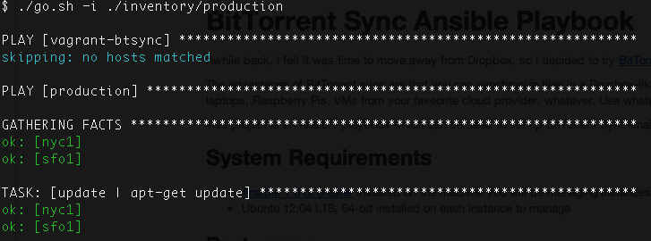
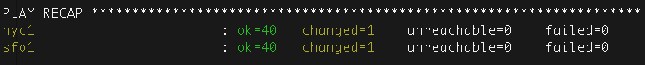

# BitTorrent Sync Ansible Playbook

Awhile back, I felt it was time to move away from Dropbox, so I decided to try [BitTorrent Sync](http://www.bittorrent.com/sync).

The advantages of BitTorrent sync are that you can synchronize files in a Dropbox-like manner, but on whatever machines you want.  Desktops, laptops, Raspberry Pis, VMs from your faveorite cloud provider, whatever.  Use whatever machines you like.

This project is an Ansible playbook which can be used to set up BitTorrent Sync-enabled instances on Digital Ocean.

## System Requirements

- [Ansible 1.6 or greater](http://www.ansible.com/home) installed on the machine you will be managing instances from
- Ubuntu 12.04 LTS, 64-bit installed on each instance to manage

## Port usage

After running this playbook against an instance, the following ports will be affectd

- **Port 80** - Blocked
- **Port 443** - Blocked
- **Port 8888** - Blocked. This is the default port that btsync uses, but in plaintext.  Very bad.
- **Port 8889**
	- This port is opened by this Ansible playbook.  It speaks HTTPS using a self-signed certificate and proxies to localhost:8888.
	- This port is also used to access Munin for system stats, at **https://the-hostname-or-ip:8889/munin/**

## Installation

First, set up Ansible.  Details for that are beyond the scope of this document.

Now, create 1 or more Digital Ocean droplets, and note their IPs.

Copy the file `inventory/production.example` to `inventory/production` or similar.  The file should look like this:

    [production] 
    # Ubuntu 12.04 x64
    host1 ansible_ssh_host=IP_ADDRESS ansible_ssh_private_key_file=~/.ssh/YOUR_KEY_FILE

For each Droplet you created, add a line which includes the IP address of that host, and the path to your private key file.

Finally, run the wrapper script: `./go.sh -i ./inventory/production`  If succesful, you'll see lines like this:

This will do the following:

- Create an htpasswd file to lock down access to Munin graphs
- Craete a self-signed SSL certificate if one does not already exist
- Run Ansible
    - The Ansible playbook will do a number of things that are Digital Ocean specific, such as setting up a swapfile
    - Other things done by this playbook include closing down ports 80, 443, and 8888.

When done, the recap will be shown:

For the first run, there will be many more changes, but on subsequent ones, you'll see a result similar to this one, with fewer changes.

When the run is complete, connect to `https://YOUR_DIGITAL_OCEAN_DROPLET_IP:8889/`, **set an admin password immediately**, and start adding your BitTorrent Sync keys.

Again--**I cannot stress this enough**--your BitTorrent Sync instance **has no password set by default**.  This is (for the time-being) one manual step you must take.  You will need to set an admin password before using BitTorrent Sync.

## Testing with cheetahs

Once your instance is set up, you can test Bittorrent Sync with this key:

    BCXMRZ4G3KMWAY767FK26J2YQSE35S5Z7

This will download about 10 Megabytes of pictures of cheetahs from my BitTorrent Sync swarm to your node.

## Debugging with cheetahs

This repo includes a file called `bin/sha1sum.php`.  When Ansible is run, it is installed in the ubuntu home directory.  To verify that your copy of BitTorrent Sync is working correctly, you can run this utility against the aforementioned cheetah directory as such: 

    $ ./sha1sum.php BTSync/Cheetahs/* 
    SHA1 of           BTSync/Cheetahs/Adult Cheetahs: 9ef2c457709b51014eea2b9b670825b58cf91ea3
    SHA1 of                     BTSync/Cheetahs/Cubs: 6f733aed82799cbf3ee1eef8ef3dd15027dc2c99
    SHA1 of             BTSync/Cheetahs/Mom and Cubs: bf36ce2c7f80c611bcfc755bcc5a5fb1dfadb630
    SHA1 of                         ALL OF THE ABOVE: 4f67535322f45323a5fa0bf6a693a2c79885a008

If those checksums do not match, something has gone wrong.

## Help contribute to this project!

I would be more than happy to add support for VMs from EC2, Rackspace, and other VPS providers.  Just let me know.

## Where can this be found?

I currently update this repo on GitHub and BitBucket:

- [https://bitbucket.org/dmuth/ansible-btsync](https://bitbucket.org/dmuth/ansible-btsync)
- [https://github.com/dmuth/ansible-btsync](https://github.com/dmuth/ansible-btsync)

## Contact me

I can be found on the web at [http://www.dmuth.org/contact](http://www.dmuth.org/contact)
